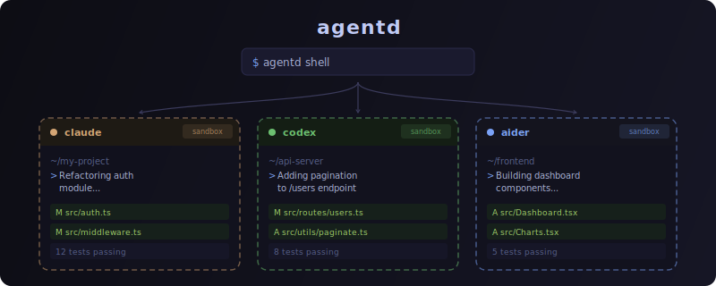

# agentd

[](https://github.com/Thegaram/agentd/actions/workflows/ci.yml)



Sandboxed AI coding agent sessions. Run coding agents (Claude Code, OpenAI Codex, aider with local models) in secure Docker containers with all dev tools pre-installed, sensible defaults, and remote control support.

## Setup

Requires Docker and Node.js 22+.

```bash
make install    # npm install + build + docker build + npm link
```

### Authentication

```bash
mkdir -p ~/.agentd/secrets && chmod 700 ~/.agentd/secrets
```

<details>
<summary><strong>Claude Code</strong></summary>

```bash
# Option 1: OAuth credentials (recommended — enables Max features)
security find-generic-password -a "$USER" -s "Claude Code-credentials" -w 2>/dev/null \
  > ~/.agentd/secrets/claude-oauth.json && chmod 600 ~/.agentd/secrets/claude-oauth.json

# Option 2: API key or setup-token (uses API balance, no Max features)
echo "ANTHROPIC_API_KEY=sk-ant-..." > ~/.agentd/secrets/claude.env && chmod 600 ~/.agentd/secrets/claude.env
```
</details>

<details>
<summary><strong>OpenAI Codex</strong></summary>

```bash
# Option 1: Copy auth.json from Codex CLI (recommended — uses existing login)
cp ~/.codex/auth.json ~/.agentd/secrets/codex-auth.json && chmod 600 ~/.agentd/secrets/codex-auth.json

# Option 2: API key
echo "CODEX_API_KEY=sk-..." > ~/.agentd/secrets/codex.env && chmod 600 ~/.agentd/secrets/codex.env
```
</details>

<details>
<summary><strong>aider</strong> (local models — no credentials needed)</summary>

Just have [Ollama](https://ollama.ai) running on the host:

```bash
ollama serve                          # start Ollama (if not already running)
ollama pull qwen2.5-coder:7b          # download a model
```
</details>

## Usage

```bash
agentd shell [label] [options]  # start or resume a sandboxed session (mounts cwd by default)
agentd ls --format md           # list active sessions
agentd cancel <label>           # remove container and session
agentd code [label]             # open session in VS Code via Dev Containers
```

The current directory is mounted read-write at `/workspace` by default. Port 3000 is published to a random host port by default.

### Options

```
--claude                 use Claude Code backend (default)
--codex                  use OpenAI Codex backend
--aider                  use aider backend (local Ollama)
--model name             model override (agent-specific, e.g. opus, gpt-5.4)
--mount host:container   mount paths (replaces default cwd mount)
--skip-mount             don't mount current directory
--port [host:]container  port mappings (replaces default 3000)
--skip-ports             don't publish any ports
--secret scope           secret env files to pass
--rm                     auto-remove container on exit
--dry-run                print the Docker command without executing
```

### Examples

```bash
agentd shell                          # Claude session (default, mounts cwd)
agentd shell --codex                  # Codex session
agentd shell --aider                  # aider with local Ollama
agentd shell my-task --secret aws     # custom label + secrets
agentd shell --mount .:/workspace:ro  # read-only mount
agentd shell --rm                     # throwaway session
```

### Clipboard In Host tmux

`agentd` runs an inner `tmux` inside the container. To copy text from that inner shell all the way to your desktop clipboard when you launched `agentd` from a host `tmux`, make sure the host `tmux` forwards clipboard escape sequences:

```tmux
set -s set-clipboard on
set -g allow-passthrough on
```

## Security

Containers are hardened by default:

- **Capability drop**: `--cap-drop ALL --security-opt no-new-privileges`
- **Cloud metadata blocked**: IMDS endpoints (169.254.169.254, metadata.google.internal) resolve to localhost
- **Credentials read-only**: secret files mounted `:ro`, agents cannot write back to host
- **Non-root**: sessions run as `agent` user (UID 1000)

**Be aware of what you mount.** The agent has full read access to anything mounted into `/workspace`, including git history, config files, and embedded secrets. Mounted content may be sent to Anthropic or OpenAI servers as part of the agent's conversation context. If the agent is compromised or tricked via prompt injection, mounted data could also be exfiltrated over the network. Avoid mounting directories containing credentials or sensitive data you don't want exposed.
