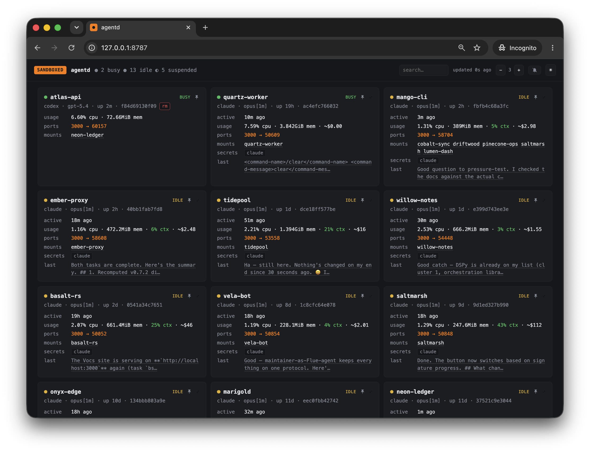

# agentd

[](https://github.com/Thegaram/agentd/actions/workflows/ci.yml)


Sandboxed AI coding agent sessions. Run coding agents (Claude Code, OpenAI Codex, aider with local models, pi) in secure Docker containers with all dev tools pre-installed, sensible defaults, and remote control support.

## Setup

Requires Docker and Node.js 22+.

```bash
make install    # npm install + build + docker build + npm link
```

Full image rebuild for upgrades (e.g. pull new Claude Code version):

```
make build DOCKER_BUILD_FLAGS=--no-cache
```

### Authentication

```bash
mkdir -p ~/.agentd/secrets && chmod 700 ~/.agentd/secrets
```

<details>
<summary><strong>Claude Code</strong></summary>

```bash
# Option 1: OAuth credentials (recommended — enables Max features)
security find-generic-password -a "$USER" -s "Claude Code-credentials" -w 2>/dev/null \
  > ~/.agentd/secrets/claude-oauth.json && chmod 600 ~/.agentd/secrets/claude-oauth.json

# Option 2: OAuth token via claude setup-token (enables Max features, no macOS Keychain needed)
echo "CLAUDE_CODE_OAUTH_TOKEN=$(claude setup-token)" > ~/.agentd/secrets/claude.env && chmod 600 ~/.agentd/secrets/claude.env

# Option 3: Anthropic Platform API key (uses API balance, no Max features)
echo "ANTHROPIC_API_KEY=sk-ant-..." > ~/.agentd/secrets/claude.env && chmod 600 ~/.agentd/secrets/claude.env
```
</details>

<details>
<summary><strong>OpenAI Codex</strong></summary>

```bash
# Option 1: Copy auth.json from Codex CLI (recommended — uses existing login)
cp ~/.codex/auth.json ~/.agentd/secrets/codex-auth.json && chmod 600 ~/.agentd/secrets/codex-auth.json

# Option 2: API key
echo "CODEX_API_KEY=sk-..." > ~/.agentd/secrets/codex.env && chmod 600 ~/.agentd/secrets/codex.env
```
</details>

<details>
<summary><strong>aider</strong> (local models — no credentials needed)</summary>

Just have [Ollama](https://ollama.ai) running on the host:

```bash
ollama serve                          # start Ollama (if not already running)
ollama pull qwen2.5-coder:7b          # download a model
```
</details>

<details>
<summary><strong>pi</strong> (<a href="https://pi.dev">pi.dev</a> — BYOK, multi-provider)</summary>

pi picks its own model from whichever provider you authenticate.

- **Subscription** (Claude Pro/Max, ChatGPT Plus/Pro): `agentd shell --pi`, then `/login` once and `/model` to pick a model. pi owns `~/.pi/agent/auth.json`, so agentd mounts nothing over it; the login persists across stop/resume and is lost only on `agentd cancel`/`--rm`.
- **API key**: `echo "OPENAI_API_KEY=sk-..." > ~/.agentd/secrets/pi.env && chmod 600 ~/.agentd/secrets/pi.env`, then `agentd shell --pi --secret pi`.

Override the model with `--model` (e.g. `--model openai/gpt-4o`); for a subscription, `/model` is more reliable.

pi has no built-in sandbox — the container is the only boundary. A repo's `.pi/` config and extensions are executable code with access to the mounted credentials, so agentd ships `defaultProjectTrust: "ask"`: pi prompts before loading them. Only trust workspaces you'd run code from, and be cautious combining `--secret pi` with an untrusted repo.
</details>

## Usage

```bash
agentd shell [label] [options]  # start or resume a sandboxed session (mounts cwd by default)
agentd ls --format md           # list active sessions
agentd cancel <label>           # remove container and session
agentd code [label]             # open session in VS Code via Dev Containers
agentd serve [--port N]         # open read-only web dashboard
```

The current directory is mounted read-write at `/workspace` by default. Port 3000 is published to a random host port by default.

### Options

```
--claude                 use Claude Code backend (default)
--codex                  use OpenAI Codex backend
--aider                  use aider backend (local Ollama)
--pi                     use pi coding agent backend (pi.dev)
--model name             model override (agent-specific, e.g. opus, gpt-5.4)
--rm                     remove container when session ends
--mount host:container   mount paths (replaces default cwd mount; repeatable)
--skip-mount             don't mount current directory
--secret scope           secret scopes to pass (defaults to agent-specific scope)
--port [host:]container  port mappings (replaces default 3000; repeatable)
--skip-ports             don't publish any ports
--persona name|path      reusable persona name (~/.agentd/persona/<name>.md) or a file path, for this session
--no-persona             don't mount any persona/instructions file
--fork label             fork an existing session into the current dir (copies its transcript)
--dry-run                print the Docker command without executing
```

### Examples

```bash
agentd shell                          # Claude session (default, mounts cwd)
agentd shell --codex                  # Codex session
agentd shell --aider                  # aider with local Ollama
agentd shell --pi                     # pi coding agent (pi.dev)
agentd shell my-task --secret aws     # custom label + secrets
agentd shell --mount .:/workspace:ro  # read-only mount
agentd shell --rm                     # throwaway session
```

**Common use cases**

```bash
# Open a shell, then open the same session in vscode devcontainer
agentd shell my-app
agentd code my-app

# Open a shell, ask the agent to build + run the app on port 3000
agentd shell my-app --port 3000
#   then tell the agent: "build and run the project on port 3000"
#   then open the mapped port on the host

# Open a shell, kick off work, detach to run in the background
agentd shell my-app
#   detach with `Ctrl-b d` (or `Ctrl-b d, Ctrl-b d` if you're in tmux)
#   the container keeps running, re-attach with: agentd shell my-app

# Dev in Claude, review the same dir read-only in Codex
agentd shell my-app
agentd shell my-app-review --codex --mount .:/workspace:ro

# Fork a session with different mounted directories
# This creates a brand new session but inherits session history
agentd shell my-app
agentd shell my-app-2 --fork my-app --mount app:/workspace
```

### Dashboard

Run `agentd serve` to show a read-only web dashboard.



### Agent persona

Optionally, configure a global or per-session agent persona (Claude's global `CLAUDE.md` file or Codex's global `AGENTS.md` file).

```bash
mkdir -p ~/.agentd/persona

# Use default.md for all agent types,
# or claude.md/codex.md for harness-specific instructions.
echo "Keep responses concise. No agent jargon." > ~/.agentd/persona/default.md

agentd shell               # use default persona
agentd shell --no-persona  # override

# Add any number of named, reusable personas.
echo "Be a meticulous code reviewer." > ~/.agentd/persona/reviewer.md

agentd shell --persona reviewer

# Or use a local .md file.
agentd shell --persona ./designer.md
```

### Shell completions

Install for zsh (needs `jq` for session labels):

```bash
mkdir -p ~/.zfunc
cp completions/_agentd ~/.zfunc/_agentd  # re-copy after upgrades
```

Then add to `~/.zshrc` (before `compinit` runs), and reload with `exec zsh`:

```zsh
fpath=(~/.zfunc $fpath)
autoload -Uz compinit && compinit
```

### Transcript persistence

Session transcripts are persisted on the host under `~/.agentd/transcripts/<uuid>/`. These remain even after container removal. Set `AGENTD_NO_TRANSCRIPTS=1` to opt out.

### Clipboard In host tmux

`agentd` runs an inner `tmux` inside the container. To copy text from that inner shell all the way to your desktop clipboard when you launched `agentd` from a host `tmux`, make sure the host `tmux` forwards clipboard escape sequences:

```tmux
set -s set-clipboard on
set -g allow-passthrough on
```

## Security

**Good enough for everyday yolo mode.** The container is *not* an airtight boundary: within the session the agent can still modify mounted files, read/use secrets and env vars you pass in, call external APIs, and use the network. Treat it as a strong guardrail, not a vault.

Containers are hardened by default:

- **Capability drop**: `--cap-drop ALL --security-opt no-new-privileges`
- **Cloud metadata blocked**: IMDS endpoints (169.254.169.254, metadata.google.internal) resolve to localhost
- **Credentials read-only**: secret files mounted `:ro`, agents cannot write back to host
- **Non-root**: sessions run as `agent` user (UID 1000)

**Be aware of what you mount.** The agent has full read access to anything mounted into `/workspace`, including git history, config files, and embedded secrets. Mounted content may be sent to Anthropic or OpenAI servers as part of the agent's conversation context. If the agent is compromised or tricked via prompt injection, mounted data could also be exfiltrated over the network. Avoid mounting directories containing credentials or sensitive data you don't want exposed.
